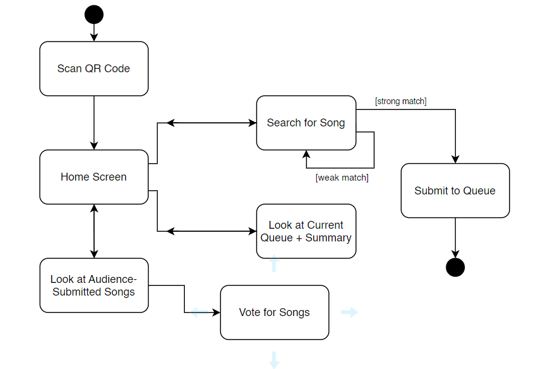
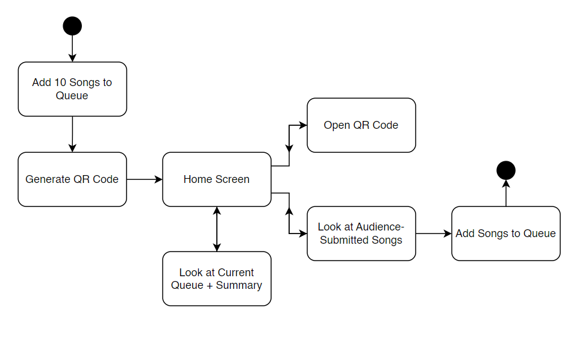

# Specification Phase Exercise

A little exercise to get started with the specification phase of the software development lifecycle. See the [instructions](instructions.md) for more detail.

## Team members

- Niket Gautam (ng2489) [GitHub profile](https://github.com/githubatit)
- Neal Haulsey (ndh3247) [GitHub profile](https://github.com/nhaulsey)
- Kevin Li (khl8545) [GitHub profile](https://github.com/Kevinli712390)
- Yura Wu (cw3460) [GitHub profile](https://github.com/yurawu27)

## Stakeholders

Katherine Han is a NYU student that is a frequent party-goer who is also a DJ at parties. She fits into this demographic as she struggles to find ways to organize requested songs at parties. As mentioned in her interview, she would like to seek ways to efficiently manage music suggestions while engaging the preferences of the crowd. 

Goals / Needs: 
- Need a portable/easy way to let the DJ know which songs to play without having to physically go up to the booth.
- Need an organized system where only the songs that fit into the assigned theme (by the host) can be requested.
- Need to ensure that the songs can be downloaded and played seamlessly on set.
- Would like to gauge/understand the preference of the audiences/crowd in real time.

Problems / Frustrations:
- Find it difficult to gauge the “vibe” of the crowd when DJ-ing/hosting at a new place.
- Traditional way (direct interaction with the DJ) could be overwhelming and chaotic as there are too many requests all at once.
- Sometimes there are too many songs requested that don’t match the theme of the party/event.
- Some people in the crowd find it intimidating to request songs so their preferences are often ignored.

## Product Vision Statement

Revolutionizing the world of live of events by empowering the attendees to directly influence the musical journey during an event through a very intuitive app, bringing about further engagement and satisfaction of attendees and DJs, hence making the events a lot more interactive and fun. 

## User Requirements

    As a club-goer, I want to suggest songs to the DJ easily, so that I can hear my favorite tracks without needing to approach the DJ booth physically.

    As a DJ, I want to set a genre or vibe for song suggestions, so that the music fits the theme of the event I'm playing at.

    As an event organizer, I want attendees to engage with the music selection, so that they feel more involved and enjoy the event more.

    As a party attendee, I want to see what songs others are suggesting, so that I can vote on them and influence the playlist with the crowd's favorite choices.

    As a music enthusiast, I want to discover what songs others are enjoying at the event, so that I can find new music that fits my taste.

    As a DJ, I want to download the most liked songs from the app to my console, so that I can seamlessly integrate audience preferences into my set.

    As a concert-goer, I want to scan a QR code to interact with the DJ, so that I can stay in the moment and not miss any part of the show while making a song request.

    As a DJ, I want to receive real-time updates on song popularity, so that I can adjust the set list on the fly to keep the energy high.

    As a bar owner, I want customers to use the app to suggest songs, so that the DJ plays music that keeps them happy and staying longer.

    As a music fan, I want to be able to like songs in the queue, so that the best songs get recognized and have a higher chance of being played.   

## Activity Diagrams

As a club-goer, I want to suggest songs to the DJ easily, so that I can hear my favorite tracks without needing to approach the DJ booth physically.

As a DJ, I want to set a genre or vibe for song suggestions, so that the music fits the theme of the event I'm playing at.

## Clickable Prototype

See instructions. Delete this line and place a publicly-accessible link to your clickable prototype here.
